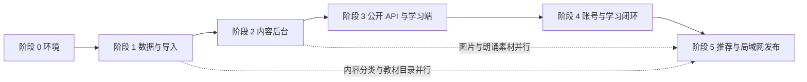

# 诗卷：少儿古诗学习平台需求基线

## 1. 文档信息

| 项目 | 内容 |
|---|---|
| 状态 | 已澄清，进入详细设计 |
| 产品 | 诗卷：面向小学生的古诗学习 Web 平台 |
| 当前阶段 | 已完成交互原型与内容平台基础，进入正式产品开发规划 |
| 目标用户 | 小学生学习者；家长和教师监督者；内容编辑；管理员 |
| 参考实现 | 根目录静态学习原型；`platform/` 内容与数据库基础 |

## 2. 背景与目标

平台通过“读诗、理解、练习、入架、复习”的闭环，帮助小学阶段学习者积累古诗，并形成可感知的掌握程度。学习端应提供多维诗词探索方式；内容端应保证原文、拼音、解析、图片、题目与分类的准确性、可审核性和可追溯性。

首期仅面向小学生提供学习体验。家长和教师首期只承担学习监督角色；制定学习计划、多孩子档案、班级管理等能力不进入首期。

首期成功标准：

- 学习者可在 3 分钟内完成一首诗的核心阅读与一次随机 3-5 题练习。
- 每首已发布诗都具备原文、可切换的逐句拼音、简略/详细解析、创作背景、至少一张合规图片、标准普通话朗诵音频和至少五道题库题目。
- 用户的学习、答题与书架状态可跨设备保存。
- 编辑可从 Excel 审核暂存区完成内容补全与发布，不需要直接操作数据库。
- 首期可在本地完成部署、内容审核、学习和数据保存，不依赖公网生产环境。

### 2.1 首期定义

首期是可在本地交付并由单一内容审核人维护的 MVP，包含：

1. 苏教版为默认教材视图，并可在学习端切换人教版。
2. 一至六年级、课外推荐、进阶学习及既定的多维分类书架。
3. 每首发布诗具备背景图、默认隐藏且可切换的逐行拼音、简略/详细解析、创作背景和 3-5 道可用练习题。
4. 每首发布诗具备标准普通话朗诵音频，详情页提供播放、暂停和重新播放控制。
5. 登录后的学习进度、熟悉程度、答题记录和个人书架；未登录用户仅可只读欣赏。
6. Excel 导入、单人审核、版本记录与回滚。

首期以当前 Excel 的全部古诗记录为发布基线。导入后需按题材、体裁、朝代、教材版本与意象分类；缺少关键字段的记录进入单人审核队列，补齐后再发布。

## 3. 异常与约束

| 场景 | 系统行为 |
|---|---|
| 未登录用户查看诗词 | 允许浏览公开内容；学习进度、答题、收藏和入架均要求登录，不保存临时学习数据。 |
| 网络或 API 不可用 | 显示可重试状态；不把本地临时状态误标为已同步。 |
| 诗词缺少拼音、解析、题目、背景图或朗诵音频 | 不允许发布；在后台显示缺失项。 |
| 朗诵音频加载或播放失败 | 显示“朗诵暂不可用”及重试入口；不伪造已播放状态。 |
| Excel 有缺少标题、作者、正文的记录 | 导入到 `staged_poems` 并标记错误；不可合并发布。 |
| 同一用户重复点击“完成并入架” | 幂等处理，只保留一条书架记录。 |
| 题目答错 | 显示提示与解析入口；记录本次错误，不终止学习。 |
| 内容被归档或下线 | 学习端不再推荐；保留用户历史记录并提示内容不可用。 |
| 图片、音频授权不清晰 | 禁止上线；后台要求补充来源、署名与版权状态。 |
| 内容、API 或 Web 版本回滚 | 保留已发布版本及变更记录；回滚产生新版本指针，不覆盖历史版本。 |

## 4. 用户与核心流程

### 4.1 用户角色

| 角色 | 核心权限 |
|---|---|
| 学习者 | 浏览、学习、答题、查看熟悉程度、收藏与管理个人书架。 |
| 家长 | 首期不提供独立端；后续可查看关联学习者的进度、复习建议和学习计划。 |
| 教师 | 首期不提供独立端；后续可查看班级学习情况并制定计划。 |
| 内容编辑 | 导入审核、创建和编辑诗词、分类、媒体、解析、题目与版本。 |
| 管理员 | 管理账号角色、审核发布、归档、回滚内容、查看运营数据。 |

### 4.2 学习主链路


### 4.3 熟悉程度

熟悉程度由原始学习行为计算，后端保存行为和最终分数：

$$
score = \min(100,\; viewScore + accuracyScore + completionScore)
$$

- 浏览：多次有效打开逐步增加，设置上限，防止重复刷分。
- 答题：依据所有有效答题的正确率计算。
- 完成：完成深度学习并确认入架后增加固定权重。
- 详情页默认只显示紧凑进度条；点击后显示浏览次数、答题正确率与完成状态。

首期采用以下可配置算法，并由管理员提供人工重置：

$$
score = \min(100,\; V + A + C + R)
$$

| 分量 | 上限 | 推荐规则 |
|---|---:|---|
| $V$ 有效浏览 | 20 | 每日每首仅计一次；详情停留至少 20 秒且正文进入可视区域，计 5 分。 |
| $A$ 答题表现 | 40 | 最近 10 次有效作答的正确率 $\times 40$；同一道题每个练习会话只计一次。 |
| $C$ 深度学习完成 | 25 | 完成一次 3-5 题练习并确认入架后计 25 分；重复完成不重复累加。 |
| $R$ 复习巩固 | 15 | 完成一次与上次有效学习相隔至少 24 小时的复习，计 5 分，最多 3 次。 |

等级阈值：`0-24 初识`、`25-49 渐熟`、`50-79 熟悉`、`80-94 掌握`、`95-100 诗友`。有效浏览、答题、完成和复习均记录原始事件，便于后续调参和人工重算。

## 5. 学习端功能需求

### 5.1 首页：今日鉴赏

**功能**：从可配置学习库中随机推荐一首已发布诗词，展示意境图、动态导语、概略鉴赏与关联诗。

| 用户动作 | 系统响应 |
|---|---|
| 打开首页 | 从全部诗库或默认库选择一首已发布诗，展示标题、作者、意境图、概略鉴赏。 |
| 选择学习库 | 从小学必备、课外推荐、进阶学习中重新取诗。 |
| 点击“换一首” | 不重复当前诗地重新推荐，并随机选择适合该诗的导语模板。 |
| 点击关联诗 | 打开该诗详情页。 |

业务规则：关联优先级为同作者、同题材、同意象；当前诗不可出现在关联结果中；关联推荐至少 3 首，不足时按其他已发布诗补全。推荐规则优先匹配当天日期关联的历史事件或季节事件；无匹配内容时，按学习库、年级和近期未推荐原则随机补足。

### 5.2 诗词书架

**功能**：提供不同认知路径浏览诗词；所有可进入详情的诗词卡片使用统一的“诗意图片背景 + 文字叠层”视觉形式。

| 分类 | 展示与筛选要求 |
|---|---|
| 小学古诗 | 一至六年级、课外推荐、进阶学习；按年级阶梯呈现。 |
| 高频题材 | 山水田园、送别抒怀、思乡怀亲、爱国边塞、咏物言志、童真童趣、传统节日、哲理说理、咏史怀古、亲情民生。题材页背景需随题材变化。 |
| 体裁与朝代 | 上古至盛唐、从中唐至明清、全卷三个时间轴视图；节点展示历史事件、诗人、体裁及关联诗。 |
| 风格与派系 | 展示派系、代表作者、风格说明、作者画意象与代表诗。首期包括浪漫主义、山水田园派、现实主义、边塞诗派、豪放词派、婉约词派。 |
| 古诗与物 | 月亮、四季、花木、山川、水、鸟、树木、风雨、雪、儿童等意象；展示对应氛围背景与诗词。 |

所有书架视图支持诗名、作者、诗句、题材、体裁、年代和意象的关键词搜索。

### 5.3 古诗详情

**功能**：在一张意境图片背景上完成从朗读到理解的阅读体验。

显示顺序：

1. 诗名、作者、朝代、年级、题材、体裁。
2. 右上角紧凑熟悉程度条。
3. 朗诵按钮，支持播放、暂停、重新播放；播放标准普通话朗诵音频。
4. 拼音按钮，默认隐藏拼音；点击后显示或隐藏每句原文上方一一对应的拼音。
5. 作者与时代。
6. 简略版“读诗小笺”。
7. 详细解析，包括关键字词、画面、结构、手法与情感。
8. 创作背景。
9. 关联古诗联想与深度学习入口。

业务规则：详情背景图片不可被整块不透明内容覆盖；拼音默认不展示，且切换状态仅影响当前浏览会话；图片、拼音、朗诵音频和解析数据缺失时应显示明确补全提示，不能静默展示错误信息。

### 5.4 深度学习与题目

**功能**：为当前诗随机抽取练习题，答题后更新掌握程度。

| 用户动作 | 系统响应 |
|---|---|
| 点击深度学习 | 创建一次练习会话，从该诗的已发布题库随机抽题。 |
| 选择错误答案 | 标示错误，保留再次作答机会，并显示引导。 |
| 选择正确答案 | 标示正确，记录题目作答结果，进入下一题。 |
| 完成所有题目 | 弹出“是否完成所有学习并添加到我的书架”的确认。 |
| 确认完成 | 更新完成时间、熟悉程度与个人书架。 |

首期要求：每首诗随机抽取 3-5 题，至少覆盖字词、画面/情感、表达手法或背景中的两类。同一题连续答错 3 次后，系统主动提示是否查看正确答案与题目解析；查看答案后仍保留本次错误记录。

### 5.5 我的古诗学习

**功能**：展示用户最近学习记录，最多 6 首，并给出继续学习或复习入口。

展示：完成数量、最近学习诗词、进度、熟悉程度、下次复习建议。未登录时展示示例状态并引导登录。

### 5.6 我的书架

**功能**：展示用户完成深度学习并确认加入的诗词。

首期按春夏秋冬组织，依据内容编辑在诗词“季节意象”分类中维护的推荐归属；不按用户完成日期自动归档。支持取消入架和进入详情。

## 6. 内容管理需求

### 6.1 内容工作流


### 6.2 后台功能

| 功能 | 要求 |
|---|---|
| Excel 导入审核 | 查看原始行、校验错误、批准、退回、合并到正式诗词。 |
| 诗词编辑 | 编辑原文、逐行拼音、简略/详细解析、创作背景、来源与发布状态。 |
| 分类编辑 | 管理年级、学习库、题材、体裁、时代、意象、派系与历史事件关联。 |
| 媒体管理 | 上传或登记背景图和标准普通话朗诵音频，维护替代文本、署名、版权状态、用途、时长与播放状态。 |
| 题库管理 | 创建题目和选项、设置唯一正确答案、题目解析、难度和发布状态。 |
| 发布校验 | 发布前检查必填字段、默认隐藏的逐行拼音、分类、审核通过的背景图和朗诵音频、至少五道已发布题。 |
| 版本与回滚 | 诗词内容、分类关联、题目和媒体关联均保留版本快照；可查看差异并回滚到任一已发布版本。 |
| 审计记录 | 记录编辑、审核、发布、归档、回滚人与时间及操作原因。 |

当前已完成：数据库基础、内容规范、Excel 暂存导入脚本、最小管理 API 和草稿/发布界面。待完成：暂存审核界面、Excel 全量分类和补全、教材版本切换、分类与题库管理、内容版本、正式身份认证。

## 7. 数据与接口要求

核心数据实体：

| 域 | 实体 |
|---|---|
| 内容 | `poems`、`authors`、`dynasties`、`media_assets`、`categories`、`historical_events`、`literary_schools` |
| 学习 | `users`、`user_poem_progress`、`learning_events`、`user_bookshelf_items` |
| 测验 | `quiz_questions`、`quiz_options`、答题记录（待建正式表） |
| 导入审核 | `content_import_jobs`、`staged_poems` |
| 版本审计 | `content_versions`、`content_change_logs`、`api_releases`、`web_releases`（待建） |

公开学习 API 需要支持：今日鉴赏、诗词检索、详情、关联诗词、分类树、时间线、派系、意象、练习题会话、学习进度、个人书架。

管理 API 需要支持：登录鉴权、导入任务、审核暂存记录、内容 CRUD、媒体上传、分类关联、题库 CRUD、发布和归档。

版本要求：

- **内容版本**：诗词、题目和分类关联发布前创建不可变快照；发布、归档、回滚均记录原因和操作者。
- **API 版本**：公开接口采用 URL 主版本，例如 `/api/v1/poems`；破坏性变更发布新主版本，旧版本在明确窗口内兼容。
- **Web 版本**：每次构建写入 Git 提交号、构建时间和语义版本；页面底部或管理后台可查看当前部署版本，并支持回滚到前一稳定构建。

## 8. 非功能要求

- 性能：普通内容查询在 $p95 < 500ms$；详情背景图片通过 CDN 或对象存储优化加载。
- 安全：首期本地环境可使用管理员令牌；后续生产环境采用正式认证与 RBAC；所有密钥仅存环境变量。
- 内容质量：发布内容有来源和审核痕迹；拼音与原文行数严格一致。
- 版权：首期仅供内网浏览，图片、音频可不附可再发布证据；但仍须记录来源、用途与审核人，且不得对公网公开或二次分发。
- 音频体验：详情页朗诵的首次可播放响应应在 $p95 < 2s$；缓冲、播放和错误状态须清晰可见。
- 可用性：桌面和移动端均可阅读，文本不与固定控件重叠；核心功能提供加载、空数据和错误状态。
- 可观测性：记录推荐曝光、详情打开、开始练习、作答、完成、入架、复习等事件。

## 9. 验收标准

### 学习端

```text
Given 已发布且资料完整的一首古诗
When 学习者打开详情
Then 系统显示该诗的图片背景、原文、朗诵按钮、拼音按钮、作者与时代、简略解析、详细解析和创作背景

Given 学习者打开一首已发布诗的详情
When 点击朗诵按钮
Then 系统播放该诗的标准普通话朗诵音频，并允许暂停或重新播放

Given 学习者打开一首诗的详情
When 未点击拼音按钮
Then 系统不显示拼音

Given 学习者点击拼音按钮
When 拼音显示被打开
Then 系统在每句原文正上方显示一一对应的拼音；再次点击后隐藏拼音

Given 学习者打开一首诗的详情
When 未点击熟悉程度条
Then 系统仅显示紧凑的熟悉度进度条

Given 学习者点击熟悉程度条
When 详情展开
Then 系统显示浏览次数、答题正确率和完成状态

Given 已发布题库有至少五题的一首诗
When 学习者完成深度学习并确认完成
Then 系统持久化答题记录，更新熟悉度，并只添加一条个人书架记录

Given 学习者对同一题连续提交三次错误答案
When 系统记录第三次错误
Then 系统提示学习者是否查看正确答案与题目解析

Given 学习者在任一书架分类查看诗词
When 系统展示可跳转的诗词卡片
Then 卡片均使用该诗对应的图片背景与文字叠层
```

### 内容端

```text
Given 一条来自 Excel 的原始诗词记录缺少作者或正文
When 编辑导入工作簿
Then 系统将记录写入审核暂存区并标记缺失字段，且不发布内容

Given 一首诗缺少逐行拼音、分类、审核通过的背景图或朗诵音频、或至少五道已发布题
When 编辑尝试发布
Then 系统阻止发布并逐项提示缺失内容

Given 编辑回滚一首已发布诗的内容版本
When 回滚被确认
Then 学习端读取被选中的历史版本，且保留回滚前后的版本与操作原因

Given 内容编辑完成审核并发布一首诗
When 学习端请求诗词列表或今日鉴赏
Then 该诗可被查询和推荐，草稿与审核中内容不可见
```

## 10. 范围与依赖

### 本期范围

- Web 学习端与内容管理后台。
- 小学一至六年级、课外推荐与进阶学习内容体系。
- 多维分类、详情朗诵、按需拼音、随机 3-5 题深度学习、个人进度和书架。
- Excel 内容导入审核、发布与内容版本回滚。
- 苏教版 2026 默认视图及人教版 2026 切换。
- 当前 Excel 全量古诗的导入、分类、补全、审核与发布。
- 局域网部署，供授权家庭或内网设备访问。

### 非本期范围

- 原生 iOS/Android 应用。
- AI 自动生成并直接发布解析、拼音、图片或题目。
- 社交排名、公开评论、直播课程、付费与订单。
- 复杂的间隔重复算法、家长多子女体系、学习计划与学校班级管理。

### 关键依赖

- PostgreSQL、Docker Desktop 和局域网稳定地址；对象存储/CDN和正式认证服务属于后续公网部署依赖。
- 苏教版 2026、人教版 2026 的目录、诗文版本和教学重点数据；Excel 全量分类与内容补全。
- Docker Desktop 用于当前本地平台启动；局域网访问需要 Windows 防火墙开放端口并固定主机 IP 或局域网域名。

## 11. 待 Review 与澄清

### 11.1 已确认决策

- 首期面向小学生；家长和教师的监督、学习计划能力后续再做。
- 教材默认苏教版 2026，并支持切换人教版 2026。
- 当前 Excel 可导入并允许二次编辑；首期由单一审核人完成审核。
- 诗词内容、API 与 Web 构建均需版本号和回滚能力。
- 发布诗词必须有审核通过的背景图与标准普通话朗诵音频；详情页必须提供播放控制和拼音显示切换。
- 图片可由网络来源、课本插图或 AI 图构成；首期仅供内网浏览，由内容审核人记录来源、用途和审核信息，无需保存可再发布证据。
- 每次深度学习随机抽取 3-5 题；同题三次答错后提示正确答案与解析。
- 熟悉程度采用有效浏览 20 分、答题表现 40 分、深度学习完成 25 分、间隔复习 15 分的可配置算法，并支持管理员人工重置。
- 我的书架的春夏秋冬由编辑推荐的诗歌季节意象决定。
- 今日鉴赏优先匹配日期关联的历史或季节事件。
- 未登录用户仅可只读欣赏；答题与学习记录必须登录。
- 首期部署在本地并支持局域网访问；仓库后续需调整为私有，Excel 与图片不再对外公开；既有 Git 历史无需清理。

### 11.2 仍需 Review 的问题

1. 苏教版 2026、人教版 2026 分别采用哪一份官方目录和诗文版本？同一首诗的教学重点是否需要按教材版本分别维护？
2. 单人审核是否必须填写审核意见和回滚原因？是否需要草稿自动保存、定时发布和版本差异对比？
3. 音频虽为可选，首期是否至少为每个年级制作若干标准普通话示范？是否需要逐句高亮、跟读或变速？
4. 每首诗的题目总库最低数量是多少？建议至少 8-10 题，以支持随机抽取 3-5 题且避免频繁重复。
5. 今日鉴赏的日期触发优先级如何定义：节气、传统节日、历史事件周年、诗人诞辰或编辑置顶？同日冲突时选择哪一种？
6. 局域网访问的授权范围、登录方式和数据备份频率如何定义？

## 12. Review 影响评估

当前剩余 Review 项不阻塞基础开发，可按下表并行推进：

| Review 项 | 对开发的影响 | 处理策略 |
|---|---|---|
| 两版教材目录和教学重点来源 | 影响首批内容映射，不影响教材版本、年级和篇目关联的数据模型。 | 先实现可配置教材版本和多对多篇目映射；内容审核时导入最终目录。 |
| 审核意见、自动保存、定时发布、版本差异 | 影响后台体验和审计细节。 | 先实现人工审核、操作原因、版本快照和即时发布；将自动保存、定时发布列为增强项。 |
| 音频示范数量、逐句高亮、跟读、变速 | 音频资产生产量和播放器增强范围。 | 首期先实现单首完整朗诵的播放、暂停、重播和失败处理；逐句高亮、跟读、变速后置。 |
| 每首题目总库数量 | 影响内容生产规模，不影响题库与随机抽题架构。 | 发布门槛固定为至少 5 题；内容目标暂按建议 8-10 题执行。 |
| 今日鉴赏日期触发优先级 | 影响推荐排序策略。 | 先实现可配置优先级和随机回退；后续由编辑维护节气、节日、历史事件和置顶规则。 |
| 局域网访问范围、登录、备份频率 | 影响部署配置和运行手册。 | 先支持单机与同网段访问、账号登录和 PostgreSQL 备份脚本；访问白名单与备份频率后续配置。 |

结论：下一阶段可立即进入数据库扩展、管理后台审核、公开学习 API、账号和学习数据同步开发；内容目录、音频规模和运营规则可并行准备。

## 13. 下一步完整开发计划

### 阶段 0：本地开发环境与基线验证

目标：让 PostgreSQL、内容 API、后台和现有原型可稳定在本机及局域网启动。

1. 安装 Docker Desktop，启动 `platform/docker-compose.yml`，验证 PostgreSQL、API、Adminer 和后台健康检查。
2. 将 API 绑定到局域网主机地址，配置 Windows 防火墙入站规则，使用同网段设备验证访问。
3. 创建本地 `.env`，替换开发管理员令牌；新增数据库备份与恢复脚本。
4. 固化 Git 版本规则：应用版本、API 主版本、数据库迁移版本和内容版本均可追溯。

验收：`/health` 可访问；后台可登录；同局域网设备可打开学习端和后台；数据库可备份及恢复到验证环境。

### 阶段 1：数据模型与内容导入审核

目标：让 Excel 全量记录成为可审核、可补全、可回滚的内容资产。

1. 新增教材表、教材版本表、教材篇目表和诗词教材映射表，支持苏教版 2026 默认和人教版 2026 切换。
2. 新增内容版本快照、内容变更日志、题目作答记录、朗诵播放记录和复习事件表。
3. 完善 Excel 导入：导入任务、错误预览、重复记录检测、字段映射、批准/退回/合并操作。
4. 建立首批分类映射模板：学习库、年级、题材、体裁、朝代、意象、派系和历史事件。
5. 编写数据校验：正文与拼音行数、分类完整度、背景图、朗诵音频、至少 5 道已发布题、教材关联。

验收：Excel 全量记录可导入暂存区；缺失字段可定位；审核通过的记录可合并为草稿；不完整内容无法发布。

### 阶段 2：内容管理后台 MVP

目标：单一审核人可不直接操作数据库完成内容发布。

1. 完成管理员登录、会话管理和角色保护，替换单一 `X-Admin-Token` 直传方式。
2. 实现暂存记录审核队列、字段补全、审批意见、合并、退回和批量操作。
3. 实现诗词编辑器：逐行正文/拼音编辑、简析、详析、创作背景、作者、朝代、教材归属和多维分类。
4. 实现媒体登记与上传：背景图、朗诵音频、来源、用途、审核状态和播放预览。
5. 实现题库编辑：5 道以上题目、唯一正确答案、题目解析、难度、发布状态。
6. 实现发布前检查、版本快照、版本差异和回滚。

验收：审核人可创建一首完整诗词并发布；发布后可在后台查看版本、回滚并验证学习端读取回滚版本。

### 阶段 3：公开内容 API 与学习端 API 化

目标：替换当前静态 `script.js` 内嵌诗词数据，使学习端只读取已发布内容。

1. 发布 `/api/v1` 内容接口：今日鉴赏、诗词列表和搜索、详情、关联诗、分类树、教材版本、时间线、派系、意象。
2. 发布媒体播放元数据接口，返回背景图与朗诵音频 URL、时长、加载状态。
3. 将现有原型拆为数据访问层和 UI 层，保留已验证的视觉与交互设计。
4. 实现详情页朗诵播放器：播放、暂停、重播、加载和错误状态。
5. 实现拼音显示切换：默认隐藏，按当前会话显示或隐藏，严格按行对应原文。
6. 实现教材版本切换，切换后刷新年级书架、推荐范围和教学内容标识。

验收：已发布诗可经 API 呈现于首页、书架和详情；草稿不可经公开 API 读取；朗诵和拼音按钮均可在真实数据下工作。

### 阶段 4：账号、学习记录与深度学习

目标：让登录用户的学习行为可跨设备保存，并形成完整练习闭环。

1. 实现学习者账号登录和会话；未登录用户保持只读，答题和书架入口提示登录。
2. 实现学习事件采集：有效浏览、朗诵播放、开始练习、题目作答、查看答案、完成、入架、复习。
3. 实现随机 3-5 题练习会话、连续答错 3 次提示答案、题目解析和答题历史。
4. 实现推荐熟悉程度算法 $V + A + C + R$、管理员人工重置及分数重算。
5. 实现最近学习不超过 6 首、我的书架、按季节归档、取消入架和复习入口。

验收：同一用户在两台局域网设备登录后可看到一致进度；完成练习后熟悉程度和个人书架准确更新；重复提交不产生重复入架记录。

### 阶段 5：推荐、内容补全与局域网发布

目标：完成首期 Excel 基线内容的发布节奏，并让日常使用稳定可靠。

1. 实现日期驱动推荐：编辑置顶、节气、传统节日、历史事件周年、季节意象和随机回退。
2. 对 Excel 全量诗词完成分类、拼音、解析、背景图、朗诵、题库和教材关联的补全与审核。
3. 建立内容完成度看板：按年级、题材、教材版本、媒体、题库和发布状态统计缺口。
4. 添加局域网运行手册、访问控制、备份计划、日志查看和故障恢复说明。
5. 执行桌面与移动端 E2E 测试、数据备份恢复演练及版本回滚演练。

验收：Excel 基线内容按计划发布；今日鉴赏可按日期规则推荐；局域网用户可稳定使用并在备份恢复后保留学习数据。

### 建议实施顺序与依赖


